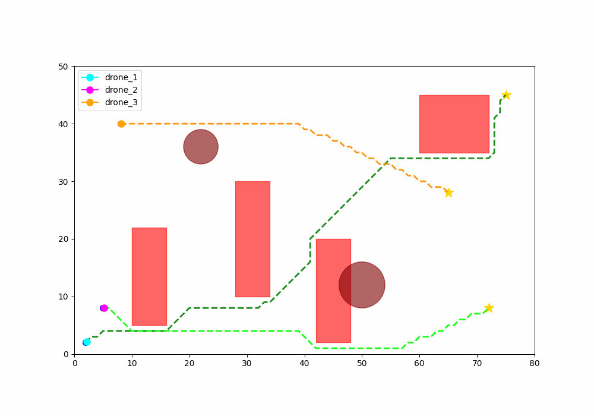
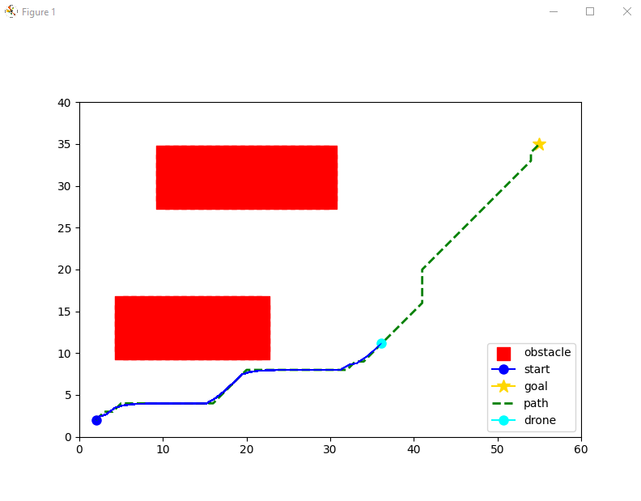
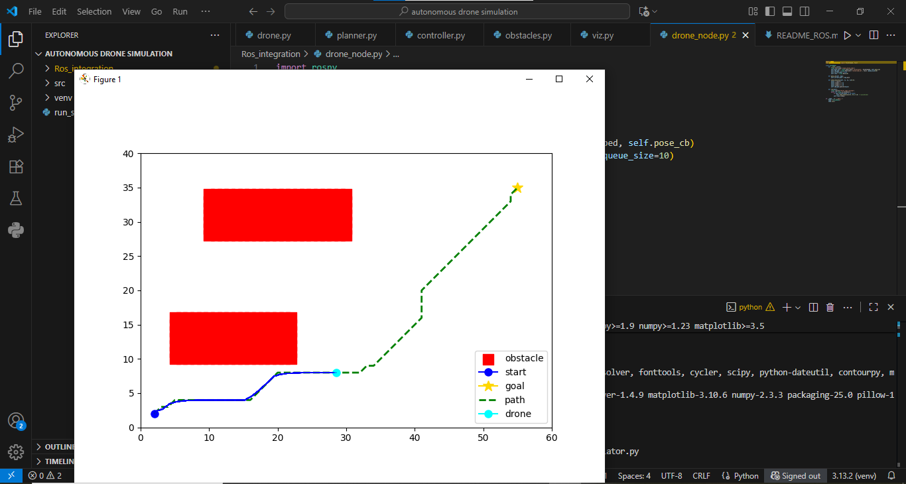

# 🚀 Autonomous Drone Flight Simulation (Python + ROS-ready)



## ✨ Overview
This project simulates **autonomous UAV navigation** with:
- ✅ **Multi-drone support**  
- ✅ **Path planning** using A*  
- ✅ **Obstacle avoidance** (rectangles + circles + random)  
- ✅ **PID control** for smooth flight  
- ✅ **Simple inter-drone collision avoidance**  
- ✅ **GIF export** for demo recordings  
- 🔧 **ROS integration skeleton** for real UAVs (PX4, Gazebo, MAVROS)

The simulator provides a **safe, cost-effective test environment** for experimenting with UAV algorithms before deploying to real hardware.  
The same principles are used in **aircraft autopilot systems**, **UAV swarm coordination**, and **urban air mobility** research.

---

## 🎥 other tests



---

## ⚙️ Installation
```bash
# clone the repo
git clone https://github.com/<your-username>/autonomous-drone-simulation.git
cd autonomous-drone-simulation

# create venv (recommended)
python -m venv venv
source venv/bin/activate   # Windows: venv\Scripts\activate

# install dependencies
pip install -r requirements.txt

🚦 Run the Simulator
python run_simulator.py


🤖 ROS Integration
Inside ros_integration/ you’ll find:
drone_node.py: a ROS node skeleton (subscribe /pose, publish /cmd_vel)
README_ROS.md: guide for connecting to Gazebo + MAVROS or a real UAV autopilot (PX4, Pixhawk)
This allows you to run the same planner/control logic on actual drones.

.

🛠️ Future Extensions
Replace A* with RRT* or D* Lite (dynamic replanning).
Add dynamic obstacles and sensor simulation (LiDAR, camera).
Upgrade controller to LQR / MPC (more realistic aircraft control).
Multi-drone traffic management (swarm coordination).

👤 Author
Muhammad Hamza
Software Engineering Student at university of Okara | UAV & AI Enthusiast

⭐ If you like this project, don’t forget to star the repo on GitHub!
