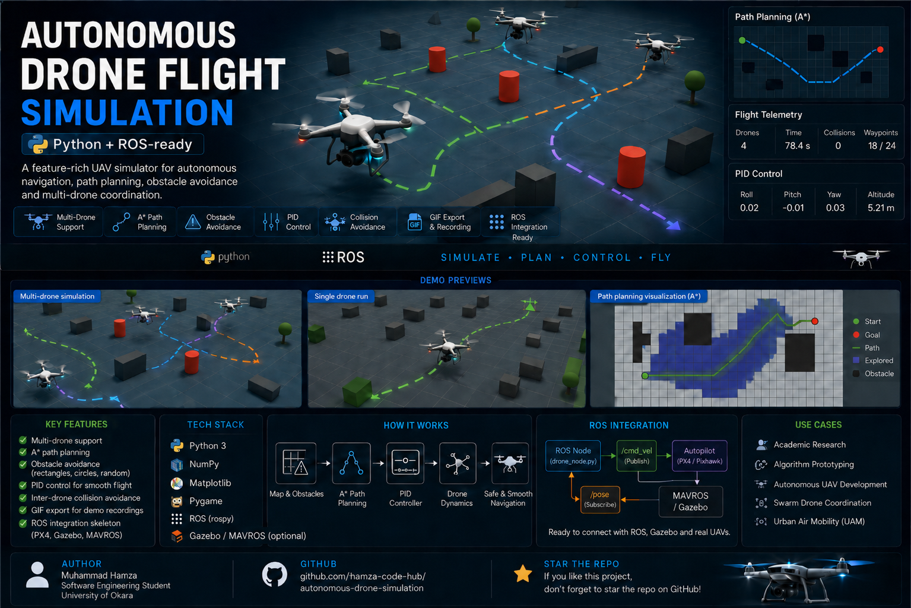
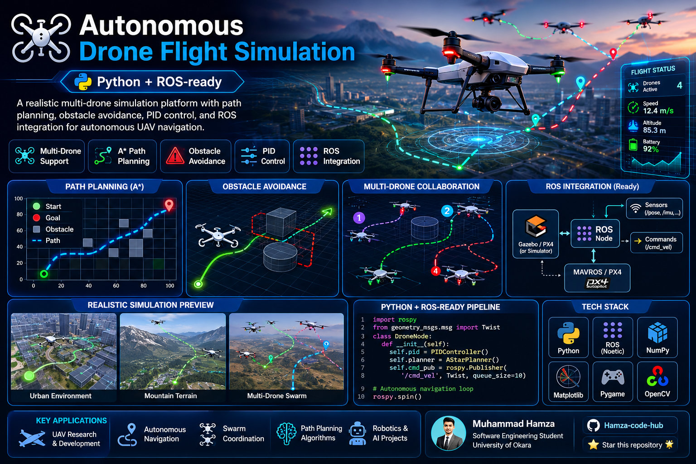
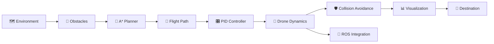
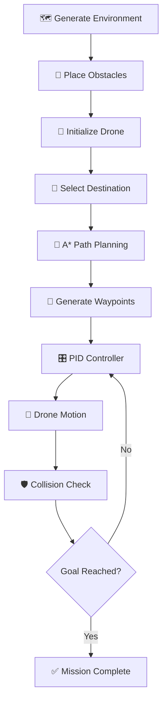
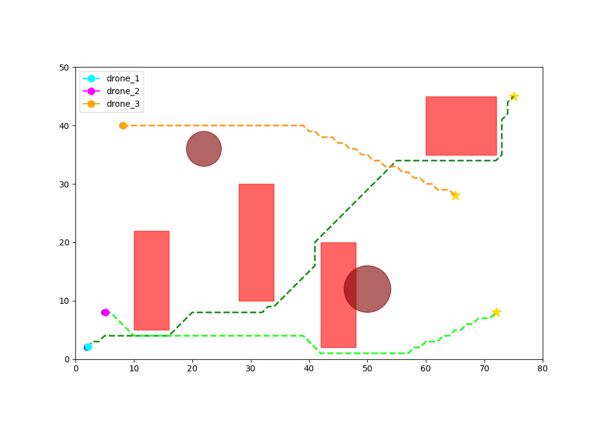
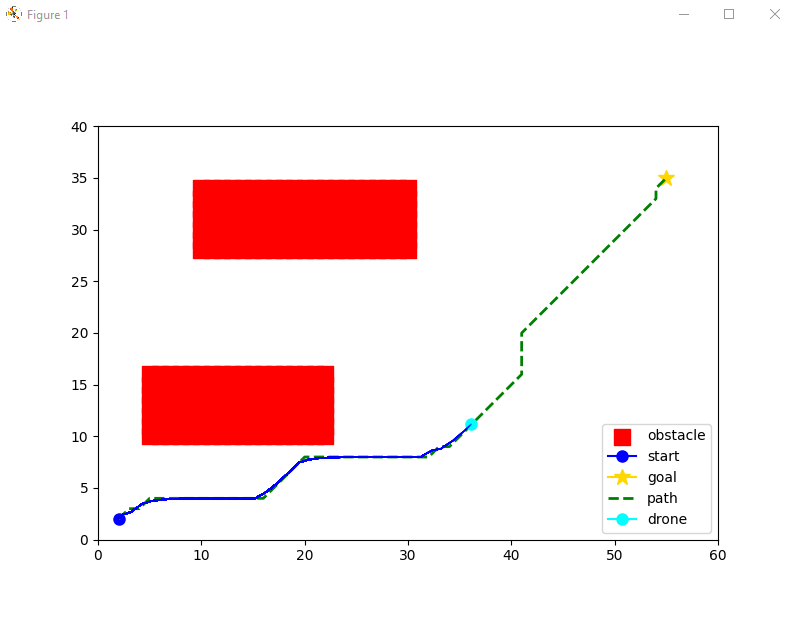
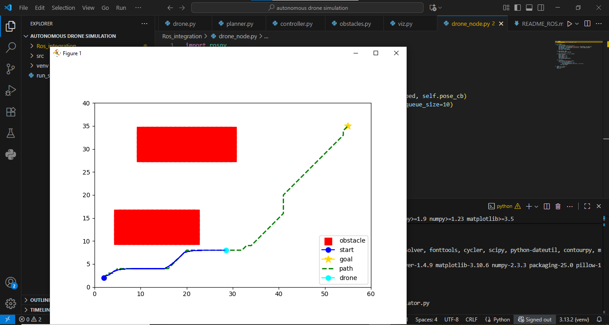

<div align="center">



<br>

# 🚁 AeroNav Sim


## Autonomous Drone Flight Simulation with Python & ROS

<p>
A modular <strong>UAV simulation platform</strong> for experimenting with
<strong>autonomous navigation, A* path planning, PID flight control,
obstacle avoidance and multi-drone coordination</strong> in a safe virtual environment.
</p>

<br>


<br>


<br>

### `Autonomous Navigation` • `A* Planning` • `PID Control` • `Multi-UAV` • `ROS` • `PX4`

</div>

---

> [!NOTE]
> This repository is a **simulation and research project**.
> The ROS components provide an integration skeleton for extending the same navigation logic toward ROS, Gazebo, MAVROS and PX4-based environments.

---

# ✨ Overview

**AeroNav Sim** is a Python-based autonomous drone simulation project built to experiment with UAV navigation algorithms before moving toward physical hardware.

The simulator combines:

```text
Environment
    │
    ▼
Map & Obstacles
    │
    ▼
A* Path Planner
    │
    ▼
PID Controller
    │
    ▼
Drone Dynamics
    │
    ▼
Collision Avoidance
    │
    ▼
Visualization
    │
    ▼
Autonomous Flight
```

The project supports both **single-drone and multi-drone scenarios**, making it useful for exploring concepts related to:

* Autonomous navigation
* UAV path planning
* Robotics
* Swarm coordination
* Flight control
* Obstacle avoidance
* ROS integration
* Urban Air Mobility research

---

# 🎯 Project Goals

The project was designed to provide a lightweight environment for studying the complete autonomous-navigation loop:

```text
        Perception of Environment
                  │
                  ▼
             Path Planning
                  │
                  ▼
             Flight Control
                  │
                  ▼
              Navigation
                  │
                  ▼
          Collision Prevention
                  │
                  ▼
            Goal Reached
```

Instead of testing experimental navigation algorithms directly on a physical UAV, developers can first validate behavior in simulation.

---

# 🚀 Core Features

<table>
<tr>
<td width="50%">

## 🚁 Multi-Drone Simulation

Run multiple UAVs inside the same simulated environment.

Supports experimentation with:

* Independent routes
* Shared airspace
* Drone separation
* Multi-UAV visualization

</td>

<td width="50%">

## 🧭 A* Path Planning

Uses the **A*** search algorithm to generate paths from start positions to goal locations while avoiding blocked areas.

</td>
</tr>

<tr>
<td>

## 🚧 Obstacle Avoidance

The environment supports different obstacle types including:

* Rectangles
* Circles
* Randomly generated obstacles

</td>

<td>

## 🎛️ PID Flight Control

A PID-based controller helps the simulated UAV follow generated paths smoothly instead of instantly jumping between coordinates.

</td>
</tr>

<tr>
<td>

## 🛡️ Collision Avoidance

Basic inter-drone collision prevention helps maintain separation when multiple UAVs share the same environment.

</td>

<td>

## 🎥 Simulation Recording

Simulation frames can be converted into animated GIF demonstrations for visual analysis and project presentation.

</td>
</tr>

<tr>
<td>

## 🤖 ROS-Ready Architecture

Includes a ROS integration skeleton for extending simulation concepts toward:

* ROS
* Gazebo
* MAVROS
* PX4
* Pixhawk environments

</td>

<td>

## 📊 Visual Debugging

Simulation rendering helps inspect:

* Planned paths
* Obstacles
* Drone positions
* Goal locations
* Flight trajectories

</td>
</tr>
</table>

---

# 🖥️ Technical Project Overview

<div align="center">



</div>

The visualization above summarizes the relationship between:

**Planning → Control → Dynamics → Navigation → ROS integration**

---

# 🧠 System Architecture


```mermaid
flowchart LR

ENV["🗺️ Environment"]

ENV --> OBS["🚧 Obstacles"]

OBS --> PLAN["🧭 A* Planner"]

PLAN --> PATH["📍 Flight Path"]

PATH --> PID["🎛️ PID Controller"]

PID --> DRONE["🚁 Drone Dynamics"]

DRONE --> COLLISION["🛡️ Collision Avoidance"]

COLLISION --> VIZ["📊 Visualization"]

VIZ --> GOAL["🎯 Destination"]

DRONE --> ROS["🤖 ROS Integration"]
```

---

# 🧭 A* Path Planning

A* searches for an efficient route between a start and destination while taking blocked cells into account.

```text
START
  │
  ▼
Search Neighbor Nodes
  │
  ▼
Calculate Cost
  │
  ├── g(n) = cost from start
  └── h(n) = estimated goal cost
  │
  ▼
f(n) = g(n) + h(n)
  │
  ▼
Select Best Candidate
  │
  ▼
Avoid Obstacles
  │
  ▼
GOAL
```

Conceptually:

```text
🟢 Start

   ↓

□ □ ■ □ □
□ ■ ■ □ □
□ □ □ □ ■
■ □ ■ □ □
□ □ □ □ 🔴

   ↓

Generated Path
```

---

# 🚧 Obstacle Environment

The simulator supports configurable obstacles.

```text
Simulation Map
│
├── Rectangle Obstacles
├── Circular Obstacles
└── Random Obstacles
```

These allow testing the planner under increasingly complex navigation scenarios.

---

# 🎛️ PID Flight Controller

The simulator uses proportional-integral-derivative control concepts to make UAV movement smoother.

```text
Target Position
      │
      ▼
Calculate Error
      │
      ▼
┌─────────────────────┐
│ P — Present Error   │
│ I — Accumulated     │
│ D — Error Change    │
└──────────┬──────────┘
           │
           ▼
     Control Output
           │
           ▼
      Drone Motion
```

General PID form:

```text
u(t) = Kp·e(t)
     + Ki∫e(t)dt
     + Kd·de(t)/dt
```

This produces more realistic path-following behavior than direct coordinate movement.

---

# 🚁 Multi-Drone Coordination

Each simulated UAV can maintain its own:

```text
Drone
│
├── Position
├── Destination
├── Planned Path
├── Velocity
├── Controller
└── Collision State
```

For multiple drones:

```text
                 Shared Airspace
                       │
       ┌───────────────┼───────────────┐
       ▼               ▼               ▼
    Drone 1          Drone 2          Drone 3
       │               │               │
       ▼               ▼               ▼
     Path 1           Path 2           Path 3
       │               │               │
       └───────────────┼───────────────┘
                       │
                       ▼
             Collision Monitoring
```

This creates a foundation for future swarm-coordination research.

---

# 🛡️ Collision Avoidance

For multi-drone environments, nearby UAV positions can be checked before movement.

Conceptually:

```text
Drone A ●────────● Drone B

        Distance

           ↓

Distance < Safety Threshold?

        ┌──────┴──────┐
        │             │
       YES            NO
        │             │
        ▼             ▼
Adjust Motion     Continue Path
```

---

# 🔄 Complete Flight Pipeline


```mermaid
flowchart TB

A["🗺️ Generate Environment"]

A --> B["🚧 Place Obstacles"]

B --> C["🚁 Initialize Drone"]

C --> D["🎯 Select Destination"]

D --> E["🧭 A* Path Planning"]

E --> F["📍 Generate Waypoints"]

F --> G["🎛️ PID Controller"]

G --> H["🚁 Drone Motion"]

H --> I["🛡️ Collision Check"]

I --> J{"Goal Reached?"}

J -->|No| G

J -->|Yes| K["✅ Mission Complete"]
```

---

# 🤖 ROS Integration

The repository contains:

```text
Ros_integration/
│
├── drone_node.py
└── README_ROS.md
```

The ROS node provides a starting point for connecting navigation logic to robotics middleware.

Conceptually:

```text
                  ROS Environment
                        │
                        ▼
                ┌────────────────┐
                │  drone_node.py │
                └───────┬────────┘
                        │
          ┌─────────────┴─────────────┐
          │                           │
          ▼                           ▼
   Subscribe /pose              Publish /cmd_vel
          │                           │
          ▼                           ▼
    UAV Position                Motion Command
          │                           │
          └─────────────┬─────────────┘
                        │
                        ▼
                 MAVROS / Gazebo
                        │
                        ▼
                     PX4
```

---

# 🔌 ROS / PX4 Direction

The existing ROS skeleton could later be extended toward:

```text
Python Planner
      │
      ▼
ROS Node
      │
      ├── /pose
      └── /cmd_vel
      │
      ▼
MAVROS
      │
      ▼
PX4 / Pixhawk
```

This makes the project useful as a stepping stone between algorithm simulation and robotics integration.

---

# 🎥 Existing Simulation Demo

The repository already includes:

```text
drone_sim.gif
```

Use it directly in the README:

<div align="center">



</div>

---

# 🧪 Additional Test Outputs

<table>
<tr>

<td align="center" width="50%">



### Single Drone Test

</td>

<td align="center" width="50%">



### Path Planning Test

</td>

</tr>
</table>

---

# 📁 Repository Structure

```text
Autonomous-Drone-Flight-Simulation-ROS/
│
├── Ros_integration/
│   │
│   ├── README_ROS.md
│   └── drone_node.py
│
├── src/
│   │
│   ├── controller.py
│   ├── drone.py
│   ├── obstacles.py
│   ├── planner.py
│   └── viz.py
│
├── assets/
│   │
│   ├── drone-simulation-hero.png
│   └── drone-simulation-overview.png
│
├── drone_sim.gif
├── dronepathcode.png
├── onedrone.png
│
├── make_gif.py
├── run_simulator.py
├── requirements.txt
└── README.md
```

---

# 🧩 Source Modules

## `drone.py`

Handles simulated UAV state and movement.

---

## `planner.py`

Contains autonomous path-planning logic.

```text
Environment
    ↓
Start / Goal
    ↓
A*
    ↓
Waypoints
```

---

## `controller.py`

Implements controller behavior used for smooth UAV navigation.

---

## `obstacles.py`

Defines and manages simulation obstacles.

---

## `viz.py`

Handles graphical visualization of:

* Environment
* UAVs
* Paths
* Obstacles
* Navigation progress

---

## `run_simulator.py`

Main simulator entry point.

---

## `make_gif.py`

Creates animated simulation demonstrations from generated frames.

---

# 🛠️ Technology Stack

<div align="center">

| Technology        | Purpose                        |
| ----------------- | ------------------------------ |
| 🐍 **Python**     | Core simulation                |
| 🔢 **NumPy**      | Numerical computation          |
| 📊 **Matplotlib** | Visualization                  |
| 🎮 **Pygame**     | Simulation / rendering support |
| 🤖 **ROS**        | Robotics integration           |
| 🚁 **PX4**        | Future autopilot integration   |
| 🔌 **MAVROS**     | ROS ↔ autopilot bridge         |
| 🌍 **Gazebo**     | Future physics simulation      |

</div>

---

# 🚀 Getting Started

## 1️⃣ Clone Repository

```bash
git clone https://github.com/Hamza-code-hub/Autonomous-Drone-Flight-Simulation-ROS.git

cd Autonomous-Drone-Flight-Simulation-ROS
```

If you have not renamed the repository yet, use its current GitHub URL.

---

# 2️⃣ Create Virtual Environment

### Windows

```bash
python -m venv .venv

.venv\Scripts\activate
```

### Linux / macOS

```bash
python3 -m venv .venv

source .venv/bin/activate
```

---

# 3️⃣ Install Dependencies

```bash
pip install -r requirements.txt
```

---

# 4️⃣ Run Simulator

```bash
python run_simulator.py
```

---

# 🎥 Generate GIF Demo

```bash
python make_gif.py
```

Generated frames can be combined into an animated demonstration for documentation or presentations.

---

# 🤖 ROS Setup

ROS-specific instructions are located in:

```text
Ros_integration/README_ROS.md
```

The integration folder currently contains the foundation for extending the project into a ROS-connected environment.

---

# 🌍 Applications

## 🚁 Autonomous UAV Development

Prototype autonomous-navigation algorithms before hardware testing.

## 🧭 Robotics Path Planning

Experiment with graph-search algorithms such as A*.

## 🐝 Swarm Robotics

Study multi-agent coordination and collision prevention.

## 🌆 Urban Air Mobility

Explore navigation concepts relevant to drones operating inside shared urban environments.

## 🛰️ Mission Planning

Study route generation between autonomous mission waypoints.

## 🎓 Academic Research

Useful for robotics, AI, autonomous systems and control-system experimentation.

---

# 🔬 Research Extensions

The current project can serve as a base for significantly more advanced autonomous-flight research.

### 🧭 Advanced Planning

```text
A*
│
├── D* Lite
├── RRT
├── RRT*
├── PRM
└── Hybrid A*
```

### 🎛️ Advanced Control

```text
PID
│
├── LQR
├── MPC
├── Adaptive Control
└── Reinforcement Learning
```

### 👁️ Perception

```text
Environment
│
├── LiDAR
├── Camera
├── Depth Camera
├── SLAM
└── Object Detection
```

---

# 🗺️ Roadmap

## ✅ Current

* [x] Multi-drone simulation
* [x] A* path planning
* [x] Obstacle generation
* [x] Rectangle obstacles
* [x] Circular obstacles
* [x] Random obstacles
* [x] PID control
* [x] Inter-drone avoidance
* [x] Simulation visualization
* [x] GIF generation
* [x] ROS integration skeleton

## 🚀 Planning

* [ ] Dynamic obstacles
* [ ] D* Lite
* [ ] RRT*
* [ ] Real-time replanning
* [ ] LiDAR simulation
* [ ] Camera simulation
* [ ] SLAM
* [ ] GPS simulation
* [ ] Wind disturbance
* [ ] Battery modeling
* [ ] LQR
* [ ] MPC
* [ ] Reinforcement learning
* [ ] Full Gazebo integration
* [ ] PX4 SITL
* [ ] MAVROS telemetry
* [ ] Mission waypoint management

## 🐝 Multi-UAV

* [ ] Formation control
* [ ] Swarm consensus
* [ ] Cooperative path planning
* [ ] Airspace reservation
* [ ] Dynamic collision resolution
* [ ] Multi-agent reinforcement learning

---

# ⚠️ Safety Disclaimer

> [!CAUTION]
> This repository is intended for **simulation, research and educational experimentation**.

The navigation and control algorithms in this repository should not be used directly to operate real aircraft or UAVs without:

* proper hardware testing
* safety validation
* failsafe systems
* flight-controller constraints
* regulatory compliance
* controlled test environments
* qualified human supervision

Real autonomous UAV systems require significantly more validation than a software simulation.

---

# 👨‍💻 Author

<div align="center">

### Muhammad Hamza

**Software Engineering • AI • UAV Systems • Autonomous Navigation**

University of Okara

<br>

[](https://github.com/Hamza-code-hub)

</div>

---

<div align="center">

# 🚁 AeroNav Sim

## Simulate • Plan • Control • Fly

### Python × ROS × Autonomous Navigation × Multi-UAV

<br>


<br>

### 🗺️ Map → 🧭 Plan → 🎛️ Control → 🚁 Navigate

<br>

**Building autonomous navigation algorithms before they reach the sky.**

<br>

⭐ **If this project helps your research or learning, consider starring the repository.**

</div>
